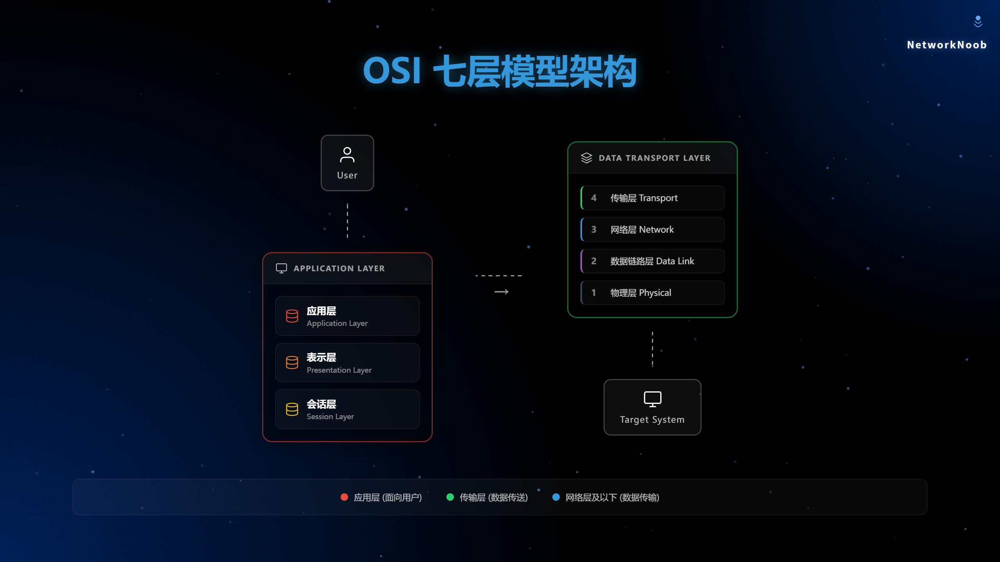
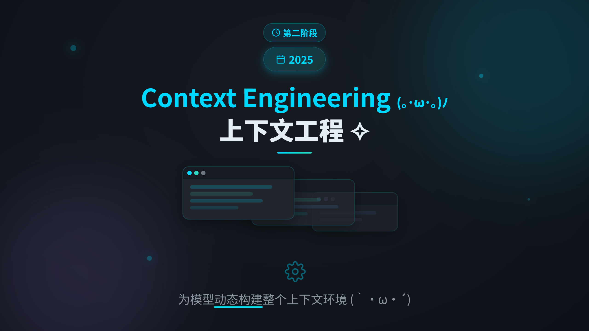
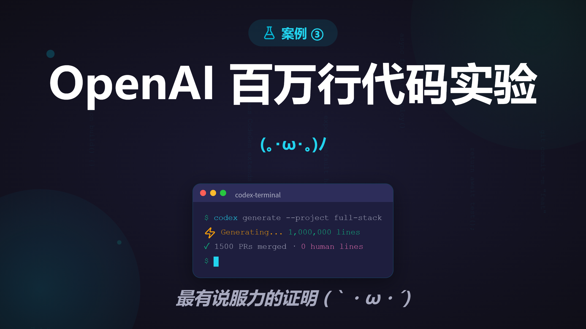
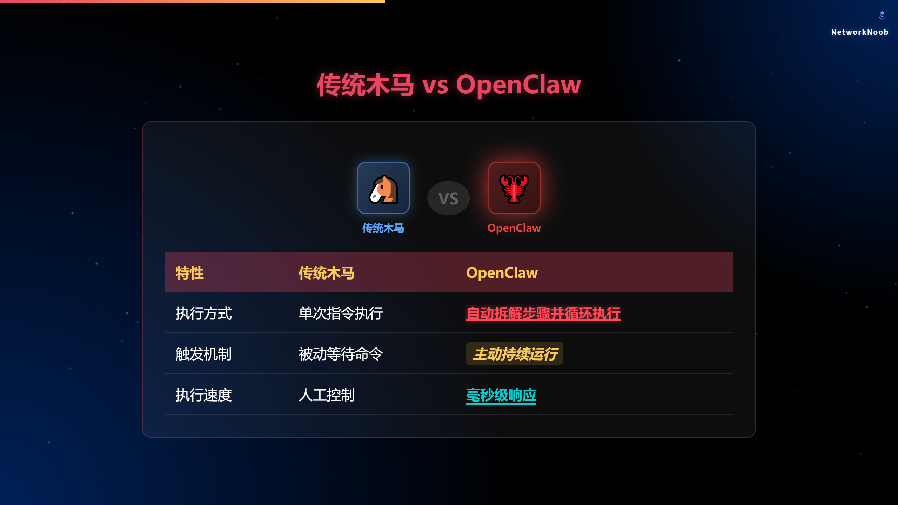
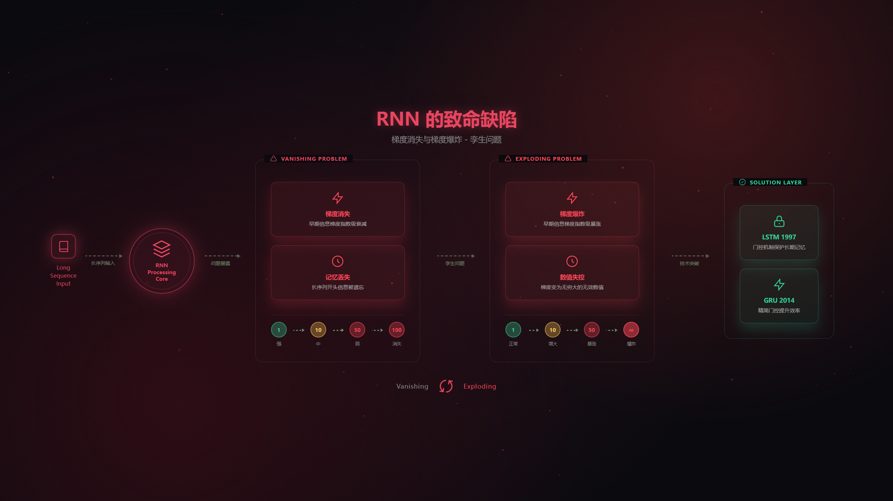
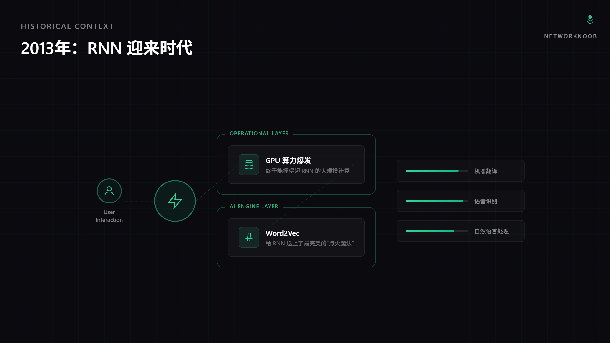

<div align="center">

# ostar-science-content-ppt

> *将科普内容文本转换为可视化PPT风格网页的 AI 工作流 Skill*

[](LICENSE)
[](assets/templates/)

<br>

**基于 [Unclecheng-li/AI-Animation-Skill](https://github.com/Unclecheng-li/AI-Animation-Skill) 改进而来。**

<br>

在原作基础上新增**总览预览**功能（按 `N` 键一键查看所有页面缩略图），
并优化了多模板对比生成的流程。

[快速开始](#快速开始) · [新增功能](#新增功能) · [模板总览](#模板总览) · [更新日志](CHANGELOG.md)

</div>

---

## 致谢

本项目基于 **[Unclecheng-li/AI-Animation-Skill](https://github.com/Unclecheng-li/AI-Animation-Skill)** 的出色工作。

感谢原作者 **Unclecheng** 创建了完整的 AI 动画生成工作流、26 个 PPT Level2 模板、14 个 Animation 模板，以及详尽的模板选择指南。本项目继承了原作的核心理念和模板体系，并在此基础上增加了实用功能。

---

## 新增功能

### 🆕 总览预览（Overview Panel）

| 模式 | 触发方式 | 说明 |
|------|---------|------|
| 模式一（原始版） | 导航栏 `⊞` 按钮 或 按 `N` 键 | 保留可见按钮 + 键盘快捷键 |
| 模式二（模板重构版） | 按 `N` 键 | 页面保持干净无 UI 元素，N 键切换 |

**总览面板特性：**
- 🖼️ 全屏网格展示所有页面 25% 缩略图
- 📄 每张卡片标注页码和页面标题
- 👆 点击卡片直接跳转到对应页面
- ⌨️ `N` / `ESC` 键快速切换
- 🧹 缩略图中自动隐藏装饰元素，保证清晰度

### 🆕 多模板对比生成

支持同时使用多个 PPT 模板生成不同风格版本，方便对比选择最佳视觉效果。

---

## 它能做什么

输入一段技术科普文本，AI 自动生成演示动画：

```
用户输入：OSI 七层模型是什么？(相关科普文档)

模式一（默认）：科普文本 → 生成基础 HTML → Level2 PPT 模板重构 → 炫酷演示文件
模式二（可选）：已生成的 HTML → Animation 流程图模板重构 → 平面 UI 风格
```

适用于 B 站视频素材、课堂教学、技术分享等场景。



---

## 快速开始

### 安装 (例：Claude Code)

```
1. 下载本项目
2. 将 ostar-science-content-ppt 文件夹复制到 ~/.claude/skills/ 目录
3. 在对话中输入 /ostar-science-content-ppt 或提供科普内容触发 Skill
```

### 使用

**模式一（PPT 演示）：**
1. 在对话中输入科普内容
2. Skill 自动生成基础 HTML → 选择 Level2 模板重构
3. 输出炫酷演示文件
4. 按 `N` 键打开总览预览所有页面

**模式二（流程图）：**
1. 先完成模式一，生成 AI_Animation.html
2. 说「生成流程图」
3. Skill 自动选择 Animation 模板重构为平面 UI 风格

---

## 项目结构

```
ostar-science-content-ppt/
├── SKILL.md                              # Skill 主文件（工作流定义）
├── README.md                             # 本文件
├── LICENSE                               # MIT 开源协议
├── CHANGELOG.md                          # 更新日志
└── assets/
    └── templates/
        ├── PPT Template-level2/          # ⭐ PPT 高级模板（优先选用，26 个）
        │   ├── SUMMARY.md                #   AI 选模板参考文档
        │   ├── 1.html ~ 9-3.html         #   9 个系列 26 个模板
        ├── PPT/                          # PPT 基础模板（回退选用）
        │   ├── PPT-Generate-1.html ~ PPT-Generate-7.html
        └── Animation/                    # 流程图模板（14 个）
            ├── SUMMARY.md                #   AI 选模板参考文档
            ├── RNN-2.html ~ RNN-7.html
            ├── LSTM-1.html
            └── ...
```

---

## 模板总览

### PPT Level2 模板（26 个，优先选用）

| 系列 | 模板数 | 适用场景 | 亮点 |
|------|--------|---------|------|
| **1** | 1 | 概念引入、对比 | VS 对比卡片 + SVG 流程图 |
| **2** | 1 | 概念定义、层级结构 | 13 种动画，最多元化 |
| **3** | 3 | 轻量/步骤/极简 | 3-3 仅 331 行最轻量 |
| **4** | 3 | 案例/实验/代码 | 代码雨动画 |
| **5** | 4 | 警示/失败/危险 | 5-4 达 15 种动画 + 13 页 |
| **6** | 4 | 护栏/架构/反馈 | 6-2 红绿 VS 对比（15 种动画） |
| **7** | 4 | 追踪/上下文/Doom Loop | 7-2 达 17 种动画 |
| **8** | 3 | 辩论/对比/融合 | 8-3 达 30 组 VS 对比 |
| **9** | 3 | 总结/共识/精炼 | 9-3 仅 5 页最精炼 |

### Animation 流程图模板（14 个）

| 模板 | 特点 | 适用场景 |
|------|------|---------|
| **RNN-3** | 分层卡片 | 通用推荐（默认） |
| RNN-4 | 标准化流程 | 22 种动画，最密 |
| RNN-6 | 梯度爆炸警示 | explode 动画 |
| LSTM-1 | 三阶段门控 | LSTM 展示 |
| word2vec-1 | 语义身份证 | 词向量 |
| Comprehension | 理解架构 | 认知类 |
| GPU | 计算节点 | 硬件展示 |

---

## 效果示例

### PPT 风格（Level2 模板重构后）






### 流程图风格（Animation 模板重构后）




---

## 技术栈

- **前端**：HTML5 + CSS3 + JavaScript（原生，无框架依赖）
- **动画**：CSS Animation / Keyframes / 3D Transform / Canvas 粒子
- **图标**：Font Awesome / Lucide / RemixIcon（按模板选择）
- **兼容性**：现代浏览器（Chrome、Firefox、Safari、Edge）

---

## 更新日志

详见 [CHANGELOG.md](CHANGELOG.md)

---

## 开源协议

本项目基于 [Unclecheng-li/AI-Animation-Skill](https://github.com/Unclecheng-li/AI-Animation-Skill)，继承其 [MIT License](LICENSE)。

```
MIT License

Copyright (c) 2026 Unclecheng (original author)
Copyright (c) 2026 ostar999

Permission is hereby granted, free of charge, to any person obtaining a copy...
```

---

<div align="center">

**如果对你有帮助，欢迎 Star ⭐**

**感谢 [Unclecheng](https://github.com/Unclecheng-li) 的原创工作 🎉**

</div>
